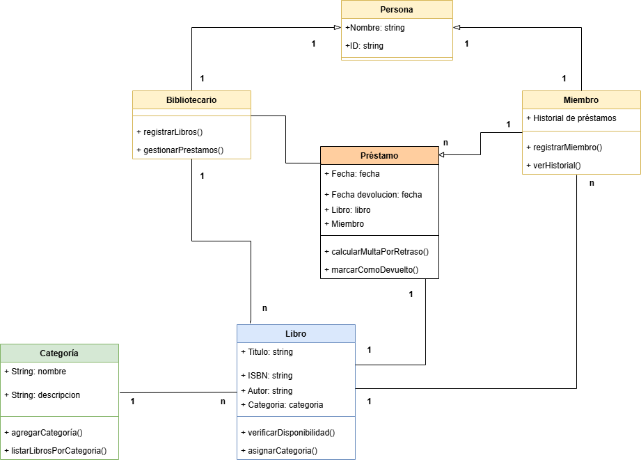

# Realización-del-diagrama-de-clases

## Ejercicio1. Sistema de Reservas de Hoteles.
 
 
 

 

---

 

    
Clic para ver el contenido

 
 
 

## Ejercicio2. Parte A: Sistema de gestión de biblioteca.
 
 
 

 

---

 

    
Clic para ver el contenido

 
 
 

## Ejercicio2. Parte B: Sistema de gestión de biblioteca.
 
 
 

    
Clic para ver el contenido

    

 

---

 

    
Clic para ver el contenido

 
 
 
